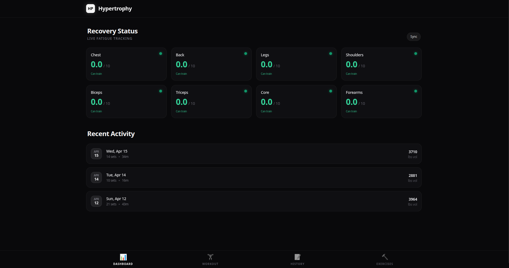
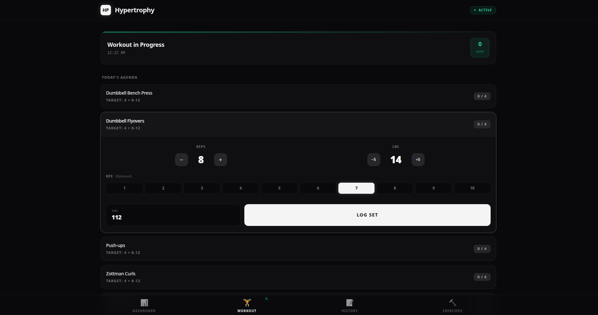
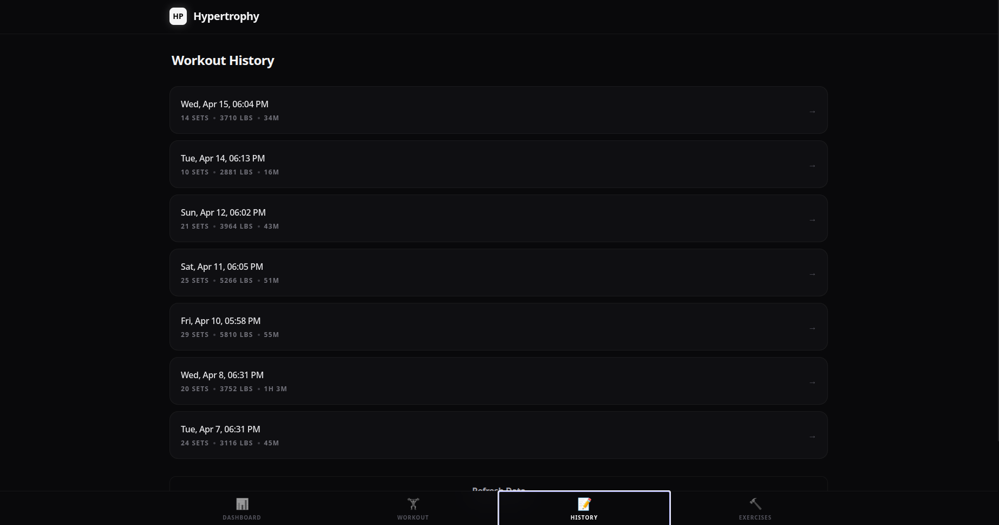
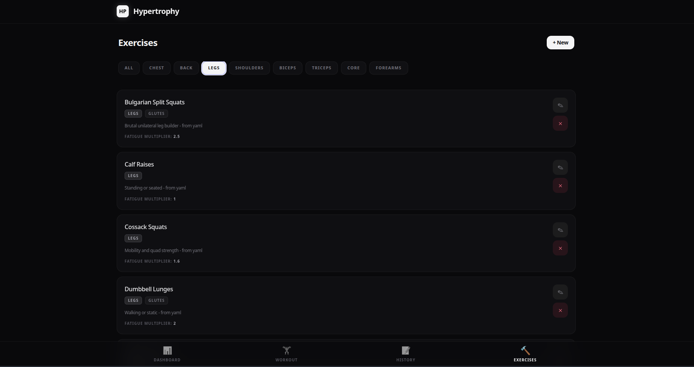
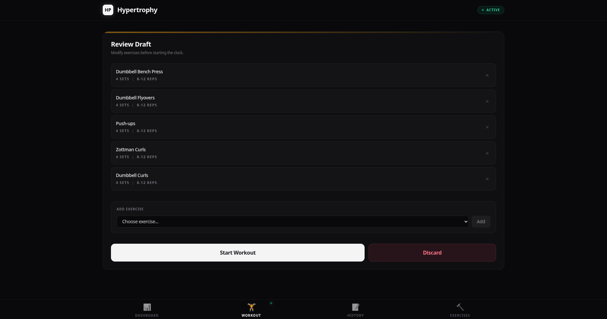

# Hyperflow

A smart, fatigue-based workout tracker designed to optimize recovery and maximize hypertrophic gains. This application tracks your muscle fatigue using exponential decay models, ensuring you never overtrain a "red-zoned" muscle group.

## Features

- **Dynamic Fatigue Tracking**: Automatically calculates muscle fatigue based on volume, RPE, and exercise intensity.
- **Exponential Recovery**: Fatigue decays naturally over time, providing real-time readiness status for every muscle group.
- **Smart Recommendations**: Suggests exercises and set targets based on your current recovery state.
- **Modern UI**: A sleek, responsive dashboard built with Svelte and TailwindCSS.

## Visual Walkthrough

<details>
  <summary><b>Dashboard</b> <i>(Click to expand)</i></summary>
  <br/>
  <p align="center">
    
  </p>
</details>

<details>
  <summary><b>Active Session</b> <i>(Click to expand)</i></summary>
  <br/>
  <p align="center">
    
  </p>
</details>

<details>
  <summary><b>History</b> <i>(Click to expand)</i></summary>
  <br/>
  <p align="center">
    
  </p>
</details>

<details>
  <summary><b>Exercises</b> <i>(Click to expand)</i></summary>
  <br/>
  <p align="center">
    
  </p>
</details>

<details>
  <summary><b>Drafting</b> <i>(Click to expand)</i></summary>
  <br/>
  <p align="center">
    
  </p>
</details>

## Tech Stack

### Frontend
- **Framework**: Svelte / Vite
- **Styling**: TailwindCSS
- **State Management**: Svelte Stores

### Backend
- **Framework**: FastAPI
- **Database**: SQLModel / SQLite
- **Environment**: Python 3.10+

## Getting Started

### Prerequisites
- Node.js & npm
- Python 3.10+ (for Python backend)
- Rust (for Rust backend)

### Quick Start (Python Backend)
1. Ensure you have the dependencies installed.
2. Run the startup script:
   ```bash
   ./run.sh
   ```
3. Open [http://localhost:5173](http://localhost:5173) in your browser.

### API Documentation
Once the backend is running, you can access the interactive Swagger docs at: [http://localhost:5100/docs](http://localhost:5100/docs)

---
*Built for lifters, by nerds*
